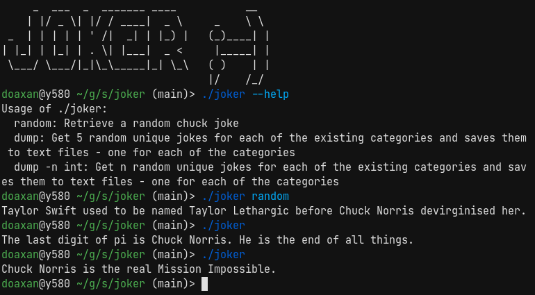

# Joker

Get random Chuck Norris jokes in terminal.

This project fetch the [chucknorris.io API](https://api.chucknorris.io).



## Installation

```bash
go get github.com/Doaxan/joker
```

Or:

```bash
go install github.com/Doaxan/joker@latest
```

## Usage
Retrieve a random chuck joke
```bash
joker random
```
Get 5 random unique jokes for each of the existing categories and saves them to text files in ./jokes/ directory - one for each of the categories
```bash
joker dump
```
You can specify the number of jokes, but note that in some categories(career, fashion, for ex.), jokes are less than 5. 
```bash
joker dump -n 7
```
